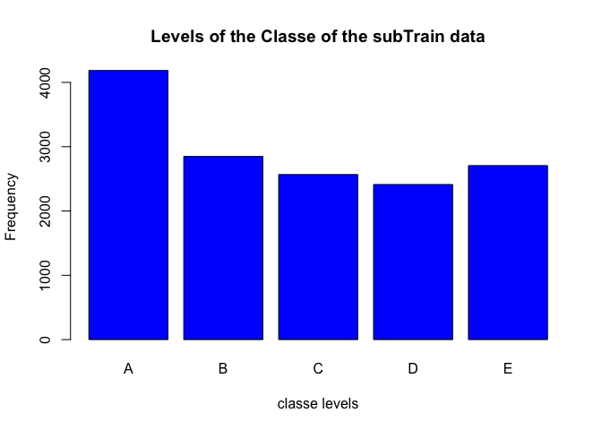
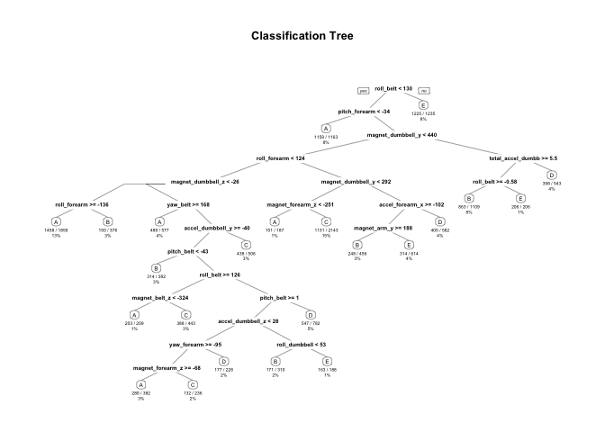

# Practical Machine Learning
Betty Yeo  
26 April 2015  

##Background

Using devices such as Jawbone Up, Nike FuelBand, and Fitbit it is now possible to collect a large amount of data about personal activity relatively inexpensively. These type of devices are part of the quantified self movement - a group of enthusiasts who take measurements about themselves regularly to improve their health, to find patterns in their behavior, or because they are tech geeks. One thing that people regularly do is quantify how much of a particular activity they do, but they rarely quantify how well they do it. 

Objective of this exercise is to use the data from accelerometers on the belt, forearm, arm, and dumbell of 6 participants is to predict the activity quality. 


##Data 

The training data is taken from : 

https://d396qusza40orc.cloudfront.net/predmachlearn/pml-training.csv

The test data is taken from: 

https://d396qusza40orc.cloudfront.net/predmachlearn/pml-testing.csv


##Load the necessary libraries 


```r
library(lattice)
library(caret)
```

```
## Loading required package: ggplot2
```

```r
library(randomForest) 
```

```
## randomForest 4.6-10
## Type rfNews() to see new features/changes/bug fixes.
```

```r
library(rpart) 
library(rpart.plot) 


# setting the overall seed
set.seed(1234)
```

##Load data sets and clean the data

```r
trainData <- read.csv("pml-training.csv", na.strings=c("NA","#DIV/0!", ""))

testData <- read.csv('pml-testing.csv', na.strings=c("NA","#DIV/0!", ""))

## Check the data size
dim(trainData)
```

```
## [1] 19622   160
```

```r
dim(testData)
```

```
## [1]  20 160
```


The training set contains 19622 observations and 160 variables, while the testing set contains 20 observations and 160 variables. 


```r
## Delete columns with all missing values
trainData <- trainData[,colSums(is.na(trainData)) == 0]
testData <- testData[,colSums(is.na(testData)) == 0]

## Remove columns that do not contribute to the prediction model
trainData <- trainData[,-c(1:7)]
testData <- testData[,-c(1:7)]

dim(trainData)
```

```
## [1] 19622    53
```

```r
dim(testData)
```

```
## [1] 20 53
```

We have reduced to 53 variables.

##Partitioning the training data set to allow cross-validation

In order to perform cross-validation, the training data set is partionned into 2 sets: 75% subTrain and 25% subTest. This will be performed using random subsampling.


```r
subsamples <- createDataPartition(y=trainData$classe, p=0.75, list=FALSE)
subTrain <- trainData[subsamples, ] 
subTest <- trainData[-subsamples, ]
```

## Take a look at the data graphically

The variable "classe" contains 5 levels: A, B, C, D and E. The "classe" variable in the training set is the outcome to predict. A plot of the outcome variable will allow us to see the frequency of each levels in the subTraining data set and compare one another.


```r
plot(subTrain$classe, col="blue", main="Levels of the Classe of the subTrain data", xlab="classe levels", ylab="Frequency")
```

 
From the graph above, we can see that each level frequency is within the same order of magnitude of each other. Level A is the most frequent with more than 4000 occurrences while level D is the least frequent with about 2500 occurrences.


## Pediction model: Decision Tree


```r
modeldecisiontree <- rpart(classe ~ ., data=subTrain, method="class")

## Predicting:
predictiondecisiontree <- predict(modeldecisiontree, subTest, type = "class")

## Plot of the Decision Tree
rpart.plot(modeldecisiontree, main="Classification Tree", extra=102, under=TRUE, faclen=0)
```

 

```r
## Test results on our subTesting data set:
confusionMatrix(predictiondecisiontree, subTest$classe)
```

```
## Confusion Matrix and Statistics
## 
##           Reference
## Prediction    A    B    C    D    E
##          A 1235  157   16   50   20
##          B   55  568   73   80  102
##          C   44  125  690  118  116
##          D   41   64   50  508   38
##          E   20   35   26   48  625
## 
## Overall Statistics
##                                           
##                Accuracy : 0.7394          
##                  95% CI : (0.7269, 0.7516)
##     No Information Rate : 0.2845          
##     P-Value [Acc > NIR] : < 2.2e-16       
##                                           
##                   Kappa : 0.6697          
##  Mcnemar's Test P-Value : < 2.2e-16       
## 
## Statistics by Class:
## 
##                      Class: A Class: B Class: C Class: D Class: E
## Sensitivity            0.8853   0.5985   0.8070   0.6318   0.6937
## Specificity            0.9307   0.9216   0.9005   0.9529   0.9678
## Pos Pred Value         0.8356   0.6469   0.6313   0.7247   0.8289
## Neg Pred Value         0.9533   0.9054   0.9567   0.9296   0.9335
## Prevalence             0.2845   0.1935   0.1743   0.1639   0.1837
## Detection Rate         0.2518   0.1158   0.1407   0.1036   0.1274
## Detection Prevalence   0.3014   0.1790   0.2229   0.1429   0.1538
## Balanced Accuracy      0.9080   0.7601   0.8537   0.7924   0.8307
```

```r
##Prediction model: Using Random Forest
```

```r
modelrandomforest <- randomForest(classe ~. , data=subTrain, method="class")


# Predicting:
predictionrandomforest <- predict(modelrandomforest, subTest, type = "class")

# Test results on subTesting data set:
confusionMatrix(predictionrandomforest, subTest$classe)
```

```
## Confusion Matrix and Statistics
## 
##           Reference
## Prediction    A    B    C    D    E
##          A 1394    3    0    0    0
##          B    1  944   10    0    0
##          C    0    2  843    6    0
##          D    0    0    2  798    0
##          E    0    0    0    0  901
## 
## Overall Statistics
##                                           
##                Accuracy : 0.9951          
##                  95% CI : (0.9927, 0.9969)
##     No Information Rate : 0.2845          
##     P-Value [Acc > NIR] : < 2.2e-16       
##                                           
##                   Kappa : 0.9938          
##  Mcnemar's Test P-Value : NA              
## 
## Statistics by Class:
## 
##                      Class: A Class: B Class: C Class: D Class: E
## Sensitivity            0.9993   0.9947   0.9860   0.9925   1.0000
## Specificity            0.9991   0.9972   0.9980   0.9995   1.0000
## Pos Pred Value         0.9979   0.9885   0.9906   0.9975   1.0000
## Neg Pred Value         0.9997   0.9987   0.9970   0.9985   1.0000
## Prevalence             0.2845   0.1935   0.1743   0.1639   0.1837
## Detection Rate         0.2843   0.1925   0.1719   0.1627   0.1837
## Detection Prevalence   0.2849   0.1947   0.1735   0.1631   0.1837
## Balanced Accuracy      0.9992   0.9960   0.9920   0.9960   1.0000
```

##Conclusion

Accuracy for Random Forest model was 0.995 compared to 0.739 and 95% CI is (0.993, 0.997) compared to (0.760, 0.792). 
The expected out-of-sample error is estimated at 0.005, or 0.5%. 
The expected out-of-sample error is calculated as 1 - accuracy for predictions made against the cross-validation set. 
Hence the random Forest model is a better model for this scenario.


